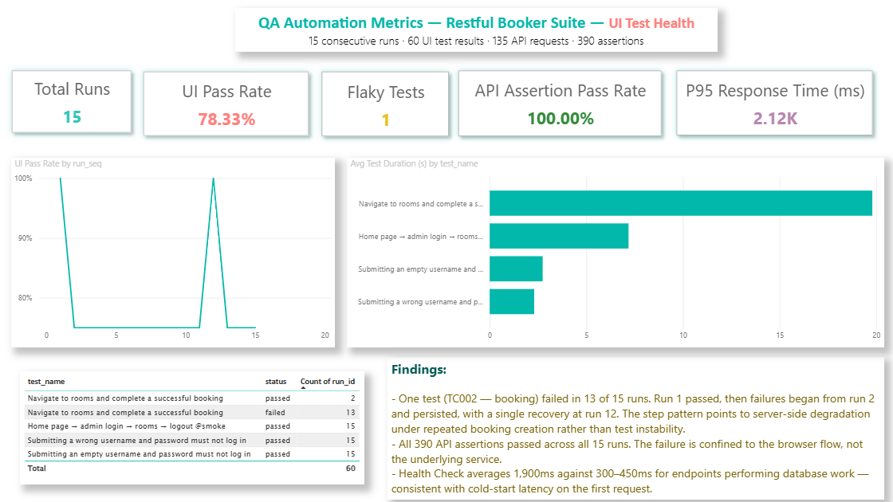
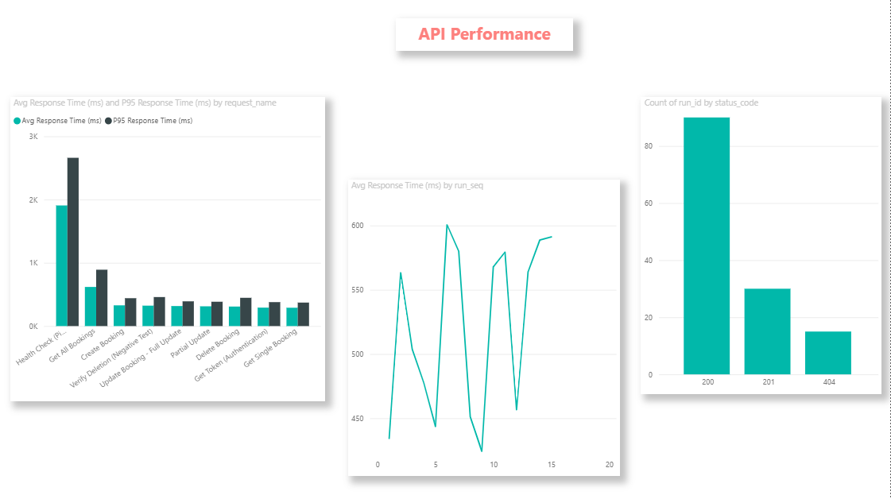

# QA Metrics Dashboard

A Power BI analytics layer built over the raw output of an automated test suite.

Test runners report a verdict for a single run. They do not tell you whether a test is
*reliably* passing, whether a suite is slowing down, or whether a failure originates in the
application or the environment. This project instruments 15 consecutive runs of a
Playwright and Postman/Newman suite, models the output as a star schema, and answers those
questions.

**The analysis found a defect the test reports did not surface** — see [FINDINGS.md](FINDINGS.md).

| | |
|---|---|
| **Source suite** | [restful-booker-automation](https://github.com/AbinayaMoorthy/restful-booker-automation) |
| **Runs collected** | 15 consecutive, over 12 minutes |
| **UI test results** | 60 (4 tests × 15 runs) |
| **API requests** | 135 (9 requests × 15 runs) |
| **API assertions** | 390 (26 assertions × 15 runs) |
| **Tooling** | PowerShell · Node.js · Power BI Desktop |

---

## Dashboard

### Page 1 — UI Test Health



### Page 2 — API Performance



---

## Headline results

| Metric | Value | Reading |
|---|---:|---|
| UI pass rate | 78.33% | 47 of 60 test results passed |
| API assertion pass rate | 100% | all 390 assertions passed, every run |
| Flaky tests | 1 | one test returned different verdicts across runs |
| P95 API response time | ~2,120 ms | against a ~350 ms average |

The gap between the two pass rates is the finding. The service layer was healthy throughout;
the failure was confined to the browser flow.

---

## How it works

```text
  Playwright ──┐
               ├──►  raw JSON per run  ──►  flatten-metrics.js  ──►  CSV  ──►  Power BI
  Newman     ──┘        (collect-runs.ps1)
```

### 1. Collect — `scripts/collect-runs.ps1`

Runs both suites repeatedly, writing each run's JSON output to a timestamped file. Multiple
runs are the point: a single run yields a snapshot, and trend, variance and flakiness are all
invisible without a series.

```powershell
.\collect-runs.ps1 -Runs 15
```

### 2. Flatten — `scripts/flatten-metrics.js`

Playwright nests suites arbitrarily deep and Newman nests assertions inside executions.
Neither shape loads usefully into a BI tool. This script walks both structures and emits flat
tables, deriving a proper timestamp from each run's filename so the model has a usable time
axis.

```powershell
node flatten-metrics.js metrics\raw metrics\csv
```

### 3. Model

`dim_runs` is the dimension; the four fact tables join to it many-to-one.

```text
                    ┌──────────────┐
                    │   dim_runs   │   one row per run (15)
                    │  run_id (PK) │
                    └──────┬───────┘
          ┌────────────────┼────────────────┬─────────────────┐
          ▼                ▼                ▼                 ▼
     ui_tests       api_requests     api_assertions          runs
      (60)              (135)             (390)               (30)
```

`runs.csv` carries two rows per run — one UI, one API — so `run_id` is not unique in it and it
cannot serve as the dimension. `dim_runs` exists for that reason.

---

## Measures

Written in DAX. The two worth explaining:

**Flakiness** — counts tests that returned more than one distinct verdict across the run
series. A test that fails consistently is broken; a test that changes its mind is flaky, and
the distinction matters because they need different fixes.

```dax
Flaky Tests =
VAR TestStatuses =
    SUMMARIZE(
        ALLSELECTED(ui_tests),
        ui_tests[test_name],
        "StatusCount", DISTINCTCOUNT(ui_tests[status])
    )
RETURN
    COUNTROWS(FILTER(TestStatuses, [StatusCount] > 1))
```

**P95 response time** — the 95th percentile rather than the mean. An average of 350 ms hides
a 2,120 ms tail, and the tail is what users experience as "the site is slow".

```dax
P95 Response Time (ms) =
PERCENTILEX.INC(api_requests, api_requests[response_time_ms], 0.95)
```

---

## Repository contents

```text
qa-metrics-dashboard/
├── dashboard/
│   └── QA-Analysis.pbix          the Power BI file
├── data/
│   ├── dim_runs.csv              15 rows  — run dimension
│   ├── ui_tests.csv              60 rows  — one row per test result per run
│   ├── api_requests.csv         135 rows  — one row per request per run
│   ├── api_assertions.csv       390 rows  — one row per assertion per run
│   └── runs.csv                  30 rows  — suite-level summary
├── scripts/
│   ├── collect-runs.ps1
│   └── flatten-metrics.js
├── screenshots/
└── FINDINGS.md
```

---

## Opening the dashboard

Download `dashboard/QA-Analysis.pbix` and open it in Power BI Desktop (free, Windows only).
No account or sign-in is required.

The data is embedded in the file, so every visual renders without the source CSVs. **Refresh
will fail** on any machine other than the one that built it, because the query paths point at
a local folder — regenerate the CSVs with the two scripts if you want to reload.

---

## Notes on the data

The suite targets `automationintesting.online` and `restful-booker.herokuapp.com`, both public
shared sandboxes. Two consequences shaped the analysis:

1. Anyone can create or delete records on either service, so absolute counts are not stable
   and nothing is asserted against a fixed dataset.
2. Both are subject to cold starts and load-related degradation. That is a limitation for
   testing, but it is what made this dataset interesting — the degradation is visible in the
   data, and separating it from genuine test instability is the analysis.

---

## Author

**Abinaya Moorthy** — QA Engineer
Test automation · API testing · CI/CD · QA analytics

---

## License

MIT — see [LICENSE](LICENSE).
